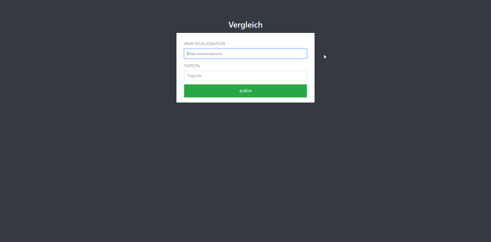
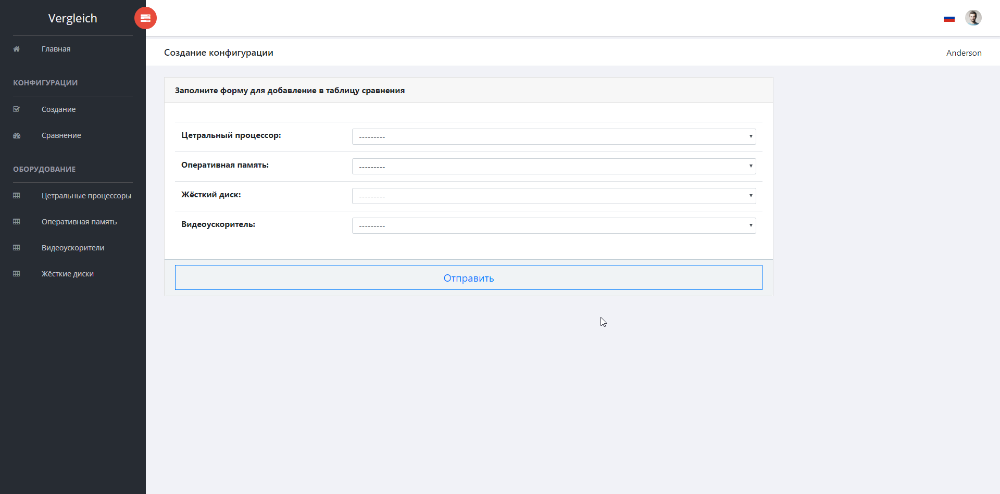
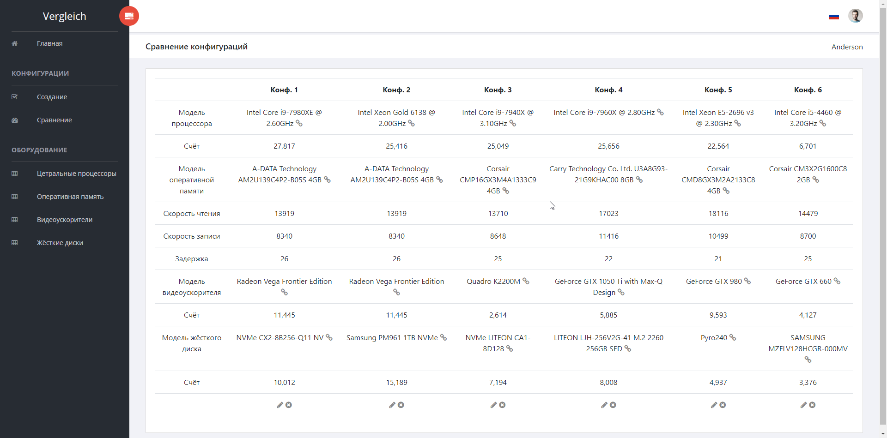

## Система сравнения компьютеров
Данный проект создаётся в качестве квалификационной работы на
окнчание курса "Объектно-ориентированное проектирование" в
Государственном научно-исследовательском университете
"Высшая школа экономики".

## Тема проекта
Требуется разработать программное обеспечение для сравнения аппаратных конфигураций компьютеров. Для анализа конфигураций заполняется несколько разных списков комплектующих для ПК: процессоры, материнские платы, ОЗУ, жесткие диски, видеокарты, аудиосистемы, интерфейсы ввода/вывода, корпуса, блоки питания и т.д. Инженер периодически решает задачу сравнения двух и более конфигураций друг с другом. Облегчить задачу сравнения может специальная программа.
Цель создания системы заключается в облегчении задачи учета комплектующих и их характеристик, проверки возможности собрать определенную конфигурацию (согласно наличию комплектующих и их совместимости) и сравнении выбранных конфигураций по формальным критериям (производительность и т.д.).

## Этапы проекта
Проект состоит из подготовительной части и практической. Подготовительная
состоит из

*  Сбор сведений и анализ
*  Проектирование системы
*  Проектирование графического интерфейса  

Практическая часть состоит из реализации спроектированных решений.

## Аналитическая часть
Вся аналитическая часть выполняется в виде [отчётного документа](desing/report/report.odt), 
который содержиться внтури репозитария.

## Практическая часть
Вся практическая часть будет доступна через данный репозиторий. Реализация проекта планируется в виде
веб-приложения. Основой приложения будет являться каркас Django. На стороне клиента так же будет
использован веб-каркас (на данный момент в стадии выбора). Описание будет обноаляться по мере
создания проекта.  
Так же в ходе проекта будет необходимость в использовании парсеров интернет ресурсов.

## История
### 2018-05-05
*  Добавлен функционал с фильтрацией данных для таблиц
*  Данные в таблицах выводятся в соответствии с заданной сортировкой
### 2018-05-04
*  Добавлена возможность просмотра таблицы с оперативной памятью
*  Во всех таблицах добавлен функционал перехода на страницу с результатами теста по щелчку на имени изделия
### 2018-05-03
*  Добавлена возможность просмотра таблицы с центральными процессорами
*  Добавлена возможность просмотра таблицы с жёсткими дисками
*  Добавлена возможность просмотра таблицы с видеоускорителями
*  В описание добавлены скриншоты
### Сделано за майские праздники
*  Написаны парсеры интернте-страниц
*  Заполнены первичные данные в базе данных
*  Создан каркас веб-страниц
### 2018-04-11
*  Создана основа Django-проекта
### 2018-03-23
*  Добавлена диаграмма прецендентов
### 2018-03-22
*  Создана часть отчёта, посвящённая анализу предметной области
*  Проработаны стили отчёта
### 2018-03-21
*  Написано введение
*  Создан отчёт
*  Создана структура папок (подробное описание на [карте](mind_map/main_map.xmind))  

## Screenshots
  
  
  
  

## Полезные ссылки
[Django](https://www.djangoproject.com/) - отличный каркас для разработки серверной части веб-приложений
с использованием языка Python  
[Python](https://www.python.org/) - ресурс, который невозможно обойти используя язык Python  
[Django tutorial by Mozilla](https://developer.mozilla.org/en-US/docs/Learn/Server-side/Django) - хорошее
руководство по использованию каркаса Django от создателей браузера FireFox  
[Awesome-django](https://github.com/rosarior/awesome-django) - проект по сбору полезных ссылок на дополнения
и расширения стандартного каркаса Django  
[Django Tips for Working with Databases](https://medium.com/@hakibenita/9-django-tips-for-working-with-databases-beba787ed7d3) - 
советы по использованию ORM в Django  
[Markdown Cheatsheet](https://github.com/adam-p/markdown-here/wiki/Markdown-Cheatsheet) - используется в
связи с оформлением данной страницы  
[Sufee HTML5 Admin Dashboard Template](https://github.com/puikinsh/sufee-admin-dashboard) - веб-основа (HTML \ CSS \ JS)